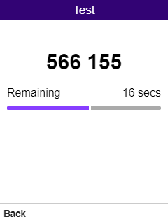

# KaiMFA

A KaiOS app that allows you to generate one time password (OTP) codes for two-factor authentication (2FA).

> The app has been submitted to KaiStore but it might take some time for them to approve it. As soon as it is available in KaiStore Utilities category this note will be removed.

## Screenshots

## Security

Taking into account [RFC 6238](https://tools.ietf.org/html/rfc6238), the app stores its authenticators' secrets in the encrypted form using the password specified on the first run of the app. The secrets decryption happens on the fly only on the authenticator page and keeps it decrypted until you leave the authenticator page to limit exposure in the RAM to a short period of time. 

When you initially specify the password it is stored in 2 places:
- Session Storage is used to store the password in the non-encrypted form to be able to encrypt new authenticators' secrets and decrypt them back when you open its page. Session Storage usage guarantees that when you close the app the password is no longer persisted in the RAM.
- Local Storage is used to store the salt and the salted password hash. This is used upon login to check that the password specified is the one that you setup initially.

SHA512 is used to hash the salted password. AES is used to encrypt and decrypt the secrets.

## Supported Features
- Setup the initial password to be able to use the app and store its secrets encrypted
- Login to the app when it is opened with the password validation
- Create a new authenticator specifying its name and secret
- Scan the QR code or fill in the secret manually
- Delete an existing authenticator
- Generate OTP codes on the authenticator page
